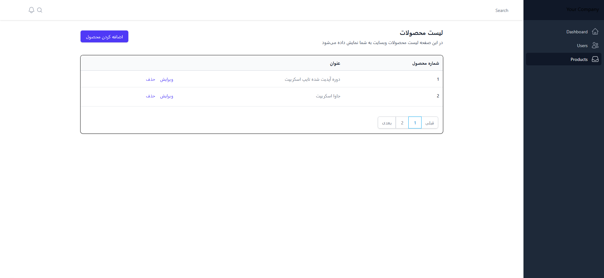
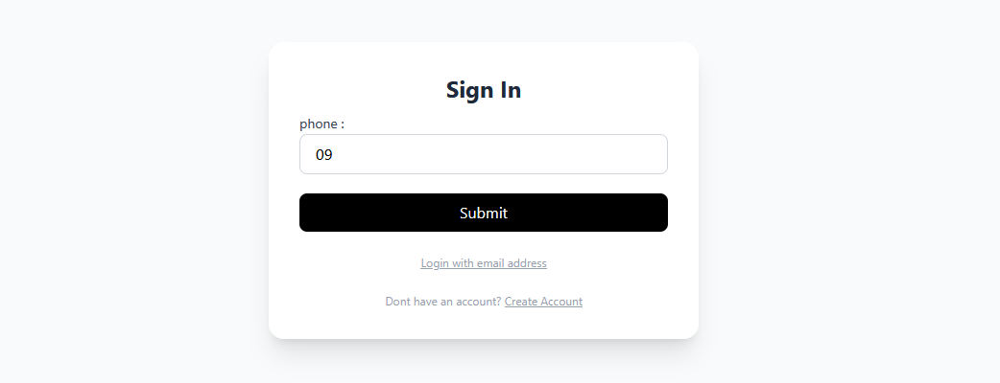

# Next.js Authentication and Admin Panel (Page Router)

A production-inspired authentication and administration system built with Next.js Page Router. This project demonstrates secure user authentication, protected routes, role-based access control, and a modern admin dashboard architecture. It highlights best practices for building scalable web applications with clean project structure and reusable components.

---

## ✨ Features

- Secure user authentication and authorization
- Protected routes with session-based access control
- Role-based access for administrators and users
- Modern admin dashboard interface
- User profile and account management
- Responsive design for desktop and mobile devices
- Form validation and error handling
- Reusable UI components and modular architecture
- Optimized routing using Next.js Page Router
- Clean and maintainable project structure

---

## 🛠️ Tech Stack

- Next.js (Page Router)
- React
- TypeScript
- NextAuth.js / Auth.js
- Tailwind CSS
- MongoDB
- Mongoose
- JWT Authentication
- React Hook Form
- Zod
- Axios

---

## 🚀 How to Run

1. Clone the repository

```bash
git clone <repository-url>
```

2. Navigate to the project directory

```bash
cd Next.js-Authentication-and-Admin-Panel-Page-Router
```

3. Install dependencies

```bash
npm install
```

4. Configure environment variables

Create a `.env.local` file and add the required environment variables.

5. Start the development server

```bash
npm run dev
```

6. Open your browser and visit:

```
http://localhost:3000
```

---

## 🎯 Purpose of This Project

This project was developed to demonstrate the implementation of a secure authentication system and a scalable admin dashboard using modern Next.js development practices. It focuses on:

- Building secure authentication and authorization flows
- Managing protected routes and user sessions
- Implementing role-based access control (RBAC)
- Designing reusable and maintainable application architecture
- Following scalable coding patterns for production-ready applications

It serves as a portfolio project showcasing practical experience in building secure, full-stack web applications with **Next.js**, **TypeScript**, and modern authentication techniques.

---

## 📩 Feedback

If you have any suggestions, improvements, or feedback, feel free to open an issue or submit a pull request.
